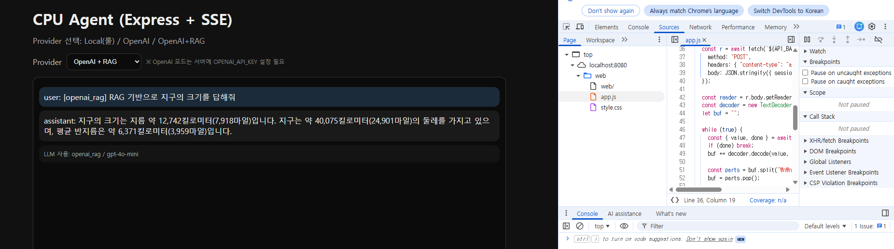

# AI Agent Service (WSL + Express + Vanilla JS + EKS CPU)



이 프로젝트는 **GPU 없이 CPU 환경**에서 동작하는 AI Agent 서비스 템플릿입니다.
핵심은 “작게 시작해서 운영 가능한 형태로 키우는 것”이며, 아래 4축으로 설계되어 있습니다.

- **Agent Runtime**: Tool Calling + Memory + Streaming(SSE)
- **Serving Layer**: Express API (`/health`, `/api/chat`, `/api/chat/stream`)
- **UI Layer**: Vanilla JS 채팅 화면 (`web/index.html`)
- **Ops Layer**: Docker → EKS(Deployment/Service/HPA) 배포

---

## 1) 이 프로젝트에서 사용하는 AI 기술(핵심 요약)

### 1-1. Tool Calling 기반 에이전트
LLM이 “직접 계산/조회”하는 대신, 도구를 선택해 실행하는 구조입니다.

- 예시 도구: `calculator`, `time`, `http_get`
- 장점:
  - 정확도 향상(계산/조회는 도구가 담당)
  - 보안 제어(allowlist, timeout, input schema)
  - 장애 분리(LLM 문제 vs 외부 API 문제 추적 용이)

> 실무 포인트: “도구 스키마 표준화 + 실행 로깅 + 타임아웃” 3가지를 먼저 고정하면 운영 난이도가 크게 낮아집니다.

### 1-2. Memory(세션 히스토리) 관리
에이전트가 이전 대화 맥락을 이어가기 위한 메커니즘입니다.

- `sessionId` 기준 히스토리 축적
- 세션 길이 제한, TTL을 통한 메모리 폭주 방지
- 추후 Redis/DB로 교체 가능한 인터페이스 설계 가능

> 실무 포인트: “무한 대화 저장”은 금물입니다. 세션별 메시지 상한과 만료 정책을 반드시 둡니다.

### 1-3. SSE 스트리밍 응답
한 번에 긴 응답을 반환하지 않고, 토큰/이벤트를 순차 전송합니다.

- 체감속도 향상(사용자가 즉시 반응 확인)
- 이벤트 확장 가능(`tool_start`, `tool_end`, `error`)
- 프론트에서 상태 기반 UX 제공 가능

> 실무 포인트: 스트리밍 종료 이벤트/에러 이벤트를 분리하면 FE 복구 로직이 단순해집니다.

### 1-4. RAG(Retrieval Augmented Generation)
로컬 문서를 임베딩/색인한 뒤 질의 시 상위 문서를 컨텍스트로 주입합니다.

- 입력: `rag/docs/*.md`
- 인덱스: `rag/rag_store.json`
- 동작: 질문 → topK 검색 → 프롬프트 컨텍스트 삽입 → 응답 생성

> 실무 포인트: RAG 성능은 모델보다도 **문서 품질/chunk 전략/메타데이터 설계** 영향이 큽니다.

---

## 2) 아키텍처 흐름

1. 사용자가 `web/index.html`에서 질문 입력
2. FE가 `/api/chat` 또는 `/api/chat/stream` 호출
3. Agent Core가 세션 히스토리 로드 + 도구 필요 여부 판단
4. 필요 시 Tool 실행(allowlist/timeout/검증 적용)
5. 응답 생성 후 JSON 또는 SSE 이벤트로 반환
6. 세션 히스토리 업데이트 및 로그 기록

---

## 3) 빠른 시작 (로컬)

```bash
cd agent-api
npm i
node src/server.js
```

브라우저:

- http://localhost:8080/health
- http://localhost:8080/web/index.html

---

## 4) 폴더 구조

- `agent-api/` : Express API + Agent Core
- `web/` : 바닐라 JS FE (SSE 스트리밍)
- `k8s/` : EKS 배포 매니페스트(Deployment/Service/HPA)
- `chapters/` : Chapter1~10 학습 가이드(MD)
- `rag/` : RAG 문서/인덱스 관련 자원

---

## 5) OpenAI + RAG 사용(선택)

- OpenAI 키는 **서버에서만** 사용해야 합니다(브라우저 노출 금지).
- RAG는 `rag/docs` 문서를 임베딩해 `rag/rag_store.json`로 저장한 뒤, 질의 시 topK를 검색해 컨텍스트로 주입합니다.

```bash
cd agent-api
cp .env.example .env
# OPENAI_API_KEY 설정 후 (또는 export OPENAI_API_KEY=...)
npm i
npm run rag:ingest
npm run dev
```

> 참고: GitHub Secrets에 저장된 키는 GitHub Actions 실행 시에만 자동 주입됩니다. 로컬 터미널에서 `npm run rag:ingest`를 실행할 때는 `.env` 또는 셸 환경변수로 직접 설정해야 합니다.

브라우저:

- http://127.0.0.1:8080/web/index.html

---

## 6) 운영/실무 체크리스트(요약)

- **보안**: OpenAI Key 서버 보관, Tool allowlist, 입력 길이 제한
- **안정성**: timeout/retry/circuit breaker 기본 정책
- **관측성**: requestId, tool latency, 에러 코드 표준화
- **비용**: CPU/메모리 requests/limits, HPA 정책, 세션 보존 정책
- **품질**: 회귀 테스트(핵심 API + 도구 + 스트리밍)

상세 실무 적용 항목은 루트 `Todo.md`를 참고하세요.
